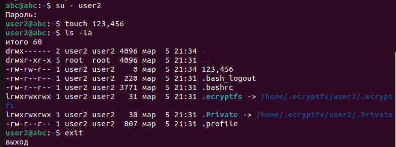

# Домашнее задание к занятию  «Защита хоста - Савельев Алексей SYS-25»

------

### Задание 1

1. Установите **eCryptfs**.
2. Добавьте пользователя user2.
3. Зашифруйте домашний каталог пользователя с помощью eCryptfs.

*В качестве ответа  пришлите снимки экрана домашнего каталога пользователя с исходными и зашифрованными данными.*  

### Ответ 1

1. Установил **eCryptfs**

2. Добавил пользвателя c шифрованием домашнего каталога **user2**

- переключился на пользователя `user2` и создал простой файл `123,456`

- посмотрел утилитой `ls -la`
- зашел под пользователем `abc` и проверил доступность домашнего каталога `user2`

3. Ответ системы из под другого пользователя:

---

### Задание 2

1. Установите поддержку **LUKS**.
2. Создайте небольшой раздел, например, 100 Мб.
3. Зашифруйте созданный раздел с помощью LUKS.

*В качестве ответа пришлите снимки экрана с поэтапным выполнением задания.*

### Ответ 2

1. Устанавливаю `Luks`:

2. Далее необходимо выделить место под диск. Поскольку работаю с ВМ, то пришлось зайти в Live CD режиме, отключить основной диск и уменьшить его на 100 Мб, для последующей работы с этим разделом.

3. Далее шифрую этот раздел:

4. Монтирую этот раздел:

5.   Форматирую раздел:

6. Создаю скрытую деркторию и монтируем к ней диск:

---

## Дополнительные задания (со звёздочкой*)

Эти задания дополнительные, то есть не обязательные к выполнению, и никак не повлияют на получение вами зачёта по этому домашнему заданию. Вы можете их выполнить, если хотите глубже шире разобраться в материале

### Задание 3 *

1. Установите **apparmor**.
2. Повторите эксперимент, указанный в лекции.
3. Отключите (удалите) apparmor.

*В качестве ответа пришлите снимки экрана с поэтапным выполнением задания.*

